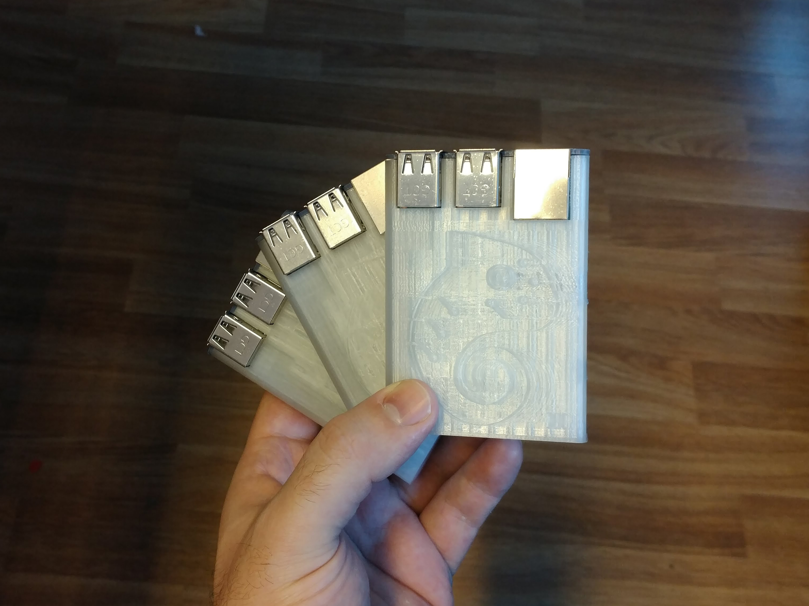

# Raspberry-Pi-Sleeve
Fits the new Raspberry Pi 3 Model B+. Reinforced pillars around the connectors. Slide the cap first, then slide everything into the sleeve until the cap mates with the sleeve.

Derivated from: https://www.thingiverse.com/thing:604915
